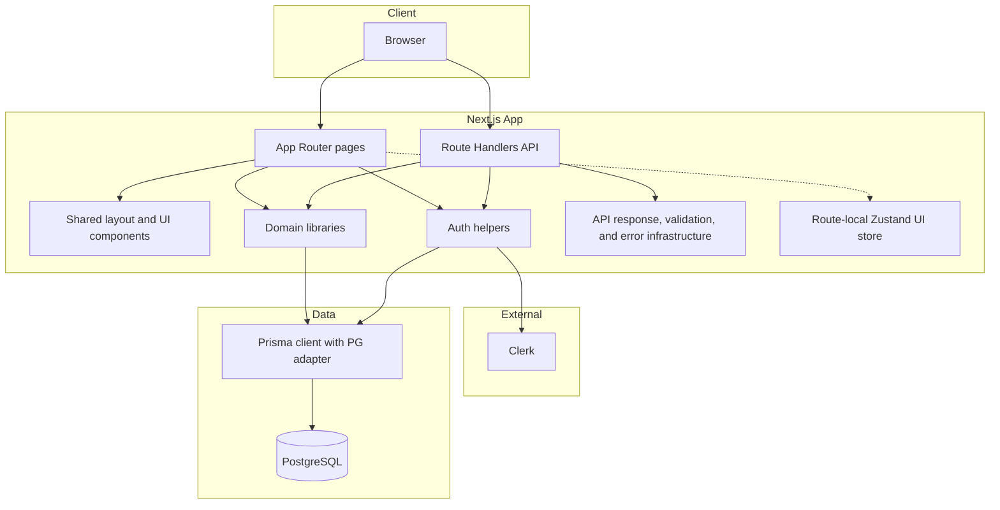
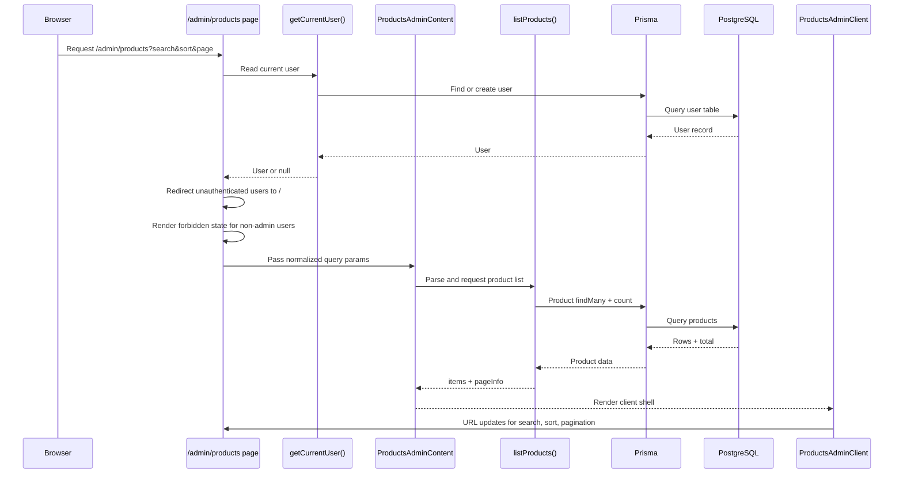
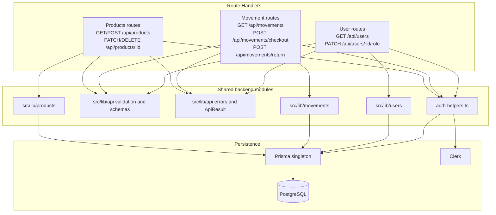
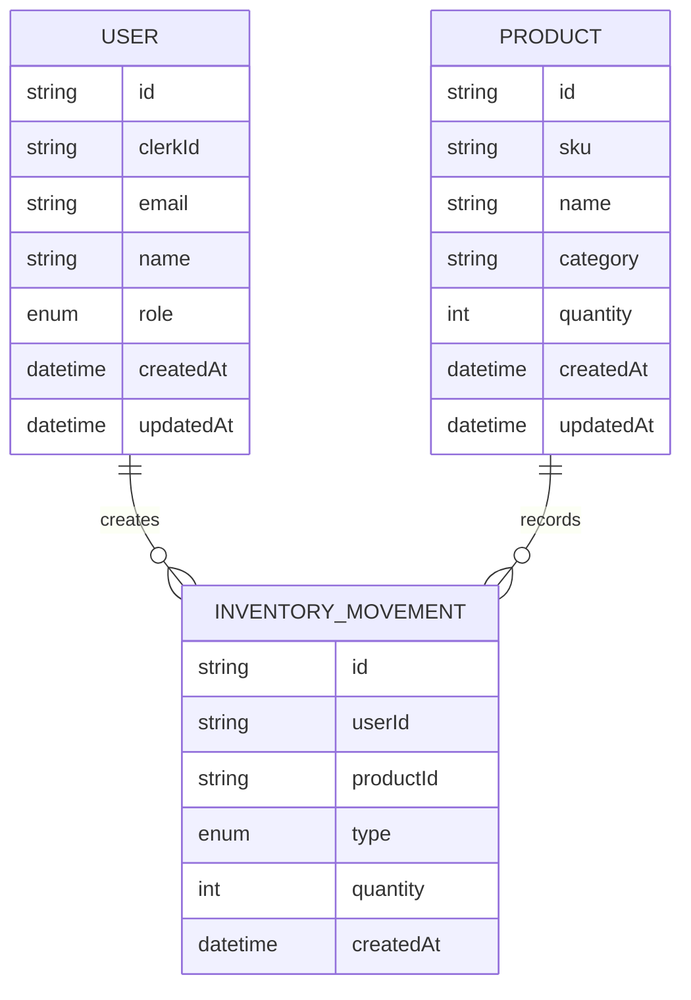
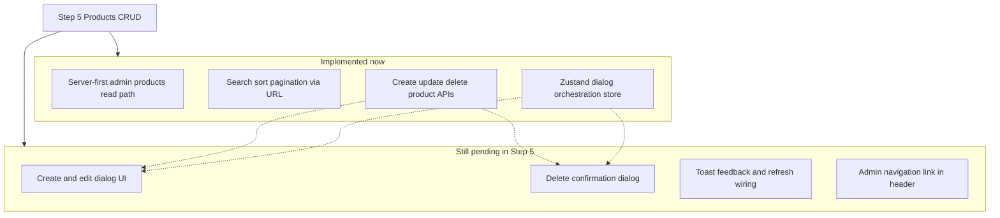

# Architecture

- Purpose: Current-state architecture only.
- Last reviewed against: `Step 5 — Products CRUD (Admin), Phase 2` on March 10, 2026.
- Update rule: Update this file in the same task whenever architecture changes.
- Scope note: This document reflects static code analysis of the current repo state unless stated otherwise.

## 1. System Context

Legend: solid arrows are primary runtime calls; dashed arrows are supporting dependencies or shared infrastructure.

The current UI surface is intentionally thin. The main implemented product surface is `/admin/products`, while the API surface is already broader and covers products, movements, and users.

## 2. Admin Products Read Path

This is the most important current request flow in the application. Product reads are server-first and do not loop back through the internal `/api/products` route.

Current client responsibilities are limited to query-string orchestration, pending-state UX, and view rendering. The create/edit/delete UI orchestration store exists but is not yet fully wired into visible mutation dialogs.

## 3. API and Backend Architecture

The backend surface is ahead of the UI surface. Products, movements, and role-management APIs exist now, but the admin UI currently exposes only the products read path.

## 4. Data Model

Current enum usage:

- `Role`: `USER`, `ADMIN`
- `MovementType`: `OUT` for checkout, `IN` for return

## 5. Step 5 Status

Known current-state notes:

- `/admin/products` reads directly from `src/lib/products/queries.ts` instead of loopback-fetching `/api/products`.
- The home page remains a development-oriented auth-sync smoke page rather than a finished product dashboard.
- The architecture document should be updated when future steps add new pages, visible movement flows, analytics surfaces, role-management UI, or new service boundaries.
